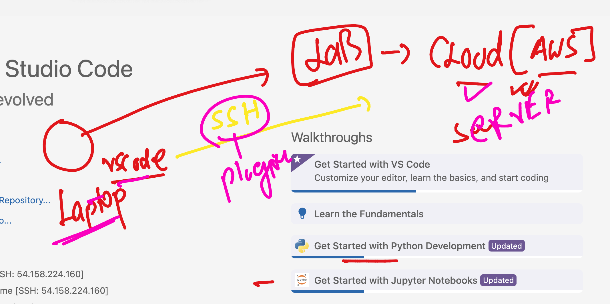
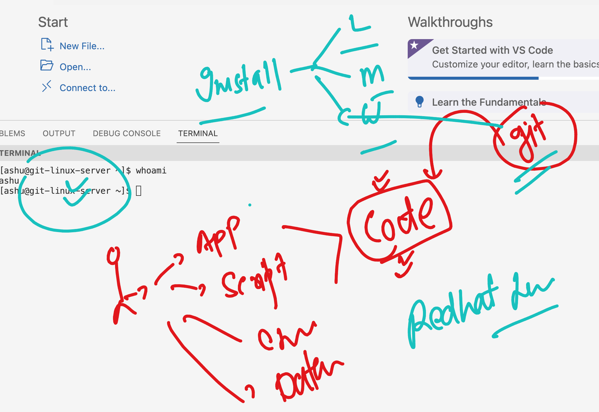
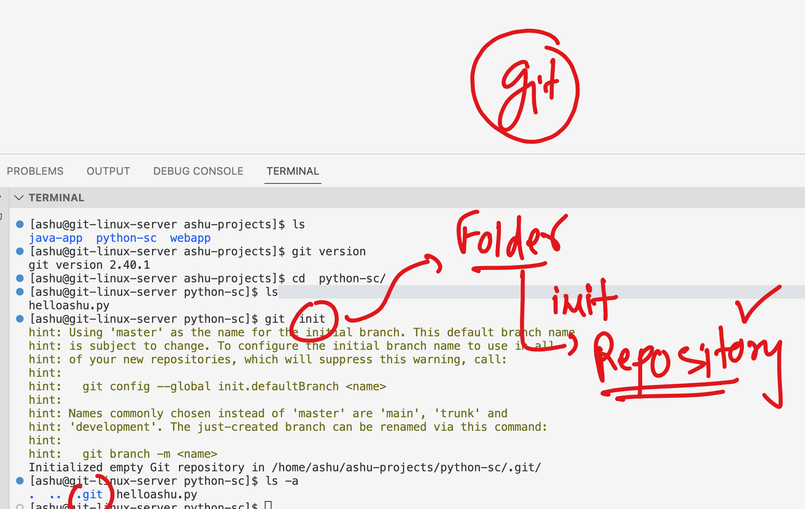
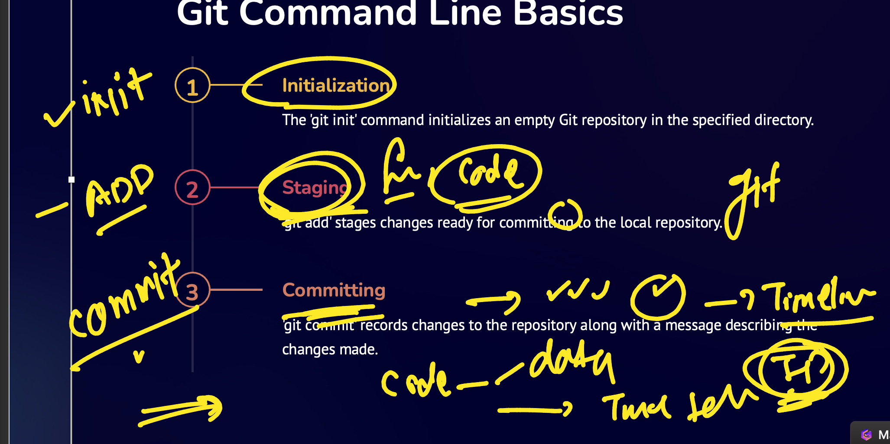
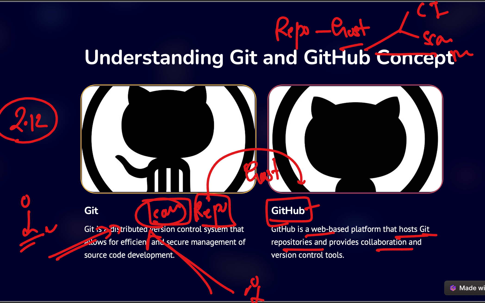
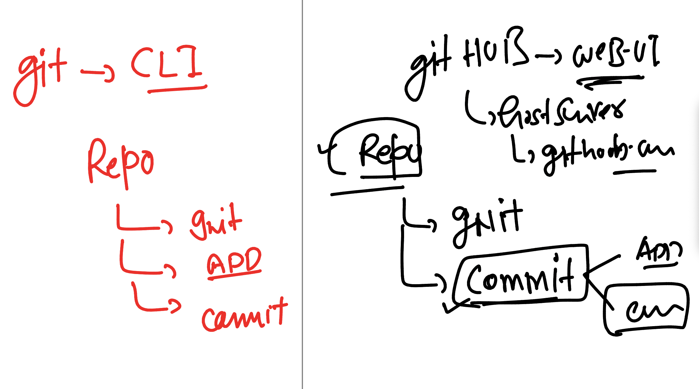
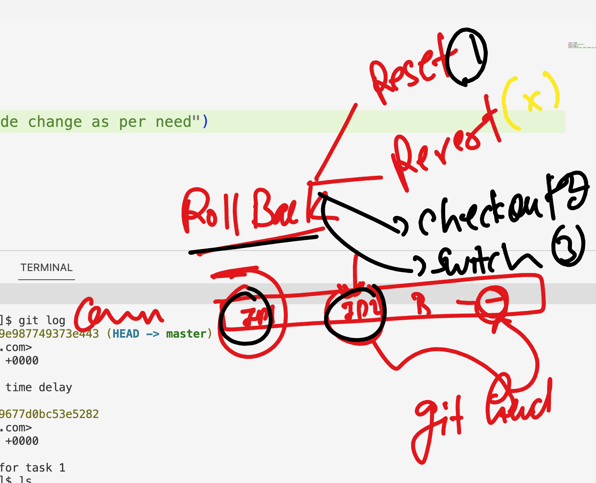
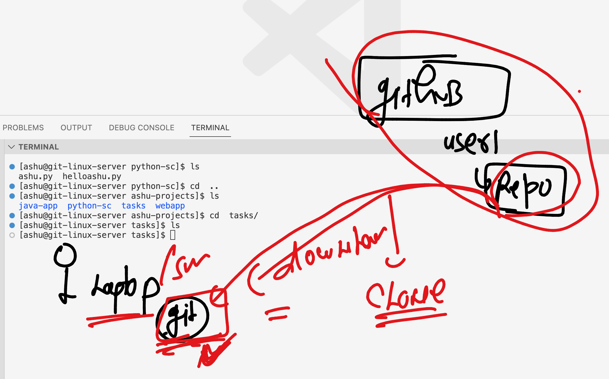
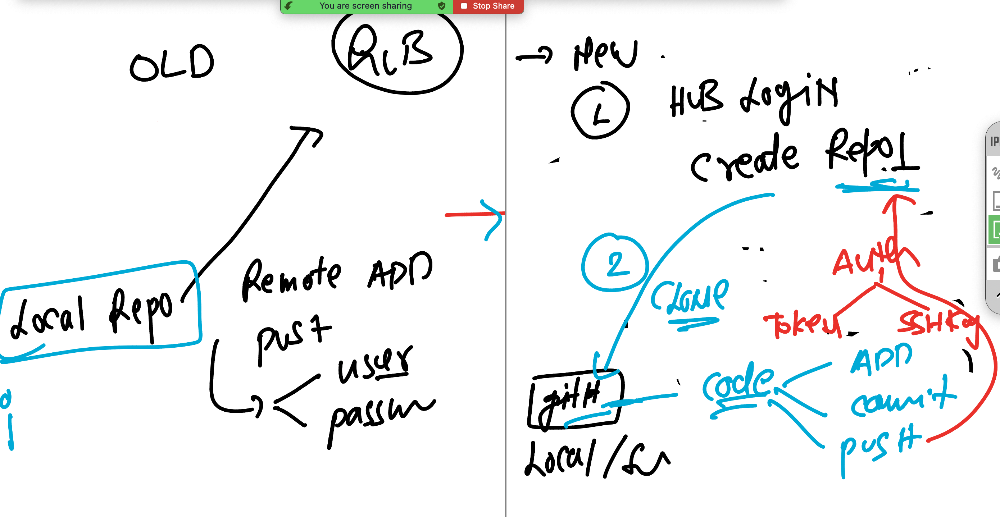

# walmart-cicd-15thjan-2024

### SCM and VSC type 


### accessing lab from local laptop using vscode 



### testing lab access from mac 

```
 ~ ssh  ashu@34.202.73.46 
The authenticity of host '34.202.73.46 (34.202.73.46)' can't be established.
ED25519 key fingerprint is SHA256:kueyu2+SHir6DIn0nHT8+M73FbqB6/LPkzhC/+g9szU.
This key is not known by any other names.
Are you sure you want to continue connecting (yes/no/[fingerprint])? yes
Warning: Permanently added '34.202.73.46' (ED25519) to the list of known hosts.
ashu@34.202.73.46's password: 
   ,     #_
   ~\_  ####_        Amazon Linux 2
  ~~  \_#####\
  ~~     \###|       AL2 End of Life is 2025-06-30.
  ~~       \#/ ___
   ~~       V~' '->
    ~~~         /    A newer version of Amazon Linux is available!
      ~~._.   _/
         _/ _/       Amazon Linux 2023, GA and supported until 2028-03-15.
       _/m/'           https://aws.amazon.com/linux/amazon-linux-2023/

-bash: warning: setlocale: LC_CTYPE: cannot change locale (UTF-8): No such file or directory
[ashu@git-linux-server ~]$ 
[ashu@git-linux-server ~]$ 
[ashu@git-linux-server ~]$ 
[ashu@git-linux-server ~]$ whoami
ashu
[ashu@git-linux-server ~]$ 


```

### same way using windows laptop also but using powershell

### Installing git in linux server



### installation link

[click_here](https://www.git-scm.com/downloads)

### Installing git on linux (redhat)

```
[ec2-user@ip-172-31-29-249 ~]$ sudo yum install git -y
Failed to set locale, defaulting to C
Loaded plugins: extras_suggestions, langpacks, priorities, update-motd
amzn2-core                                                                                                                            | 3.6 kB  00:00:00     
Resolving Dependencies
--> Running transaction check
---> Package git.x86_64 0:2.40.1-1.amzn2.0.1 will be installed
--> Processing Dependency: git-core = 2.40.1-1.amzn2.0.1 for package: git-2.40.1-1.amzn2.0.1.x86_64
--> Processing Dependency: git-core-doc = 2.40.1-1.amzn2.0.1 for package: git-2.40.1-1.amzn2.0.1.x86_64
--> Processing Dependency: perl-Git = 2.40.1-1.amzn2.0.1 for package: git-2.40.1-1.amzn2.0.1.x86_64
--> Processing Dependency: perl(Git) for package: git-2.40.1-1.amzn2.0.1.x86_64
--> Processing Dependency: perl(Term::ReadKey) for package: git-2.40.1-1.amzn2.0.1.x86_64
--> Running transaction check

```


### verify 

```
[ashu@git-linux-server ~]$ git version 
git version 2.40.1
[ashu@git-linux-server ~]$ 

```

### Creating directory structure to put some code and git to control it

```
ashu@git-linux-server ~]$ whoami
ashu
[ashu@git-linux-server ~]$ mkdir  ashu-projects
[ashu@git-linux-server ~]$ 
[ashu@git-linux-server ~]$ mkdir  ashu-projects/{webapp,python-sc,java-app}
[ashu@git-linux-server ~]$ ls
ashu-projects
[ashu@git-linux-server ~]$ ls  ashu-projects/
java-app  python-sc  webapp
[ashu@git-linux-server ~]$ 

```

## Asking Git to start monitoring / controlling directory 

--- GIT init --- 
```
[ashu@git-linux-server ashu-projects]$ ls
java-app  python-sc  webapp
[ashu@git-linux-server ashu-projects]$ git version 
git version 2.40.1
[ashu@git-linux-server ashu-projects]$ cd  python-sc/
[ashu@git-linux-server python-sc]$ ls
helloashu.py
[ashu@git-linux-server python-sc]$ git  init
hint: Using 'master' as the name for the initial branch. This default branch name
hint: is subject to change. To configure the initial branch name to use in all
hint: of your new repositories, which will suppress this warning, call:
hint: 
hint:   git config --global init.defaultBranch <name>
hint: 
hint: Names commonly chosen instead of 'master' are 'main', 'trunk' and
hint: 'development'. The just-created branch can be renamed via this command:
hint: 
hint:   git branch -m <name>
Initialized empty Git repository in /home/ashu/ashu-projects/python-sc/.git/
[ashu@git-linux-server python-sc]$ ls -a
.  ..  .git  helloashu.py
[ashu@git-linux-server python-sc]$ 
```

### folder to repo 



### Overall git --management is a 3 step process



### using add and commit 

```
[ashu@git-linux-server python-sc]$ ls
helloashu.py
[ashu@git-linux-server python-sc]$ ls  -a
.  ..  .git  helloashu.py
[ashu@git-linux-server python-sc]$ git add  helloashu.py  
[ashu@git-linux-server python-sc]$ git commit  -m  "first python working script for task 1 "
Author identity unknown

*** Please tell me who you are.

Run

  git config --global user.email "you@example.com"
  git config --global user.name "Your Name"

to set your account's default identity.
Omit --global to set the identity only in this repository.

fatal: unable to auto-detect email address (got 'ashu@git-linux-server.(none)')
[ashu@git-linux-server python-sc]$ 
```

### above details is about github -- web based repo hosting platform service 



### git vs github 



### Now to solve git commit first time problem we need to pass github account details once

```
ashu@git-linux-server python-sc]$  git config --global user.email ashutoshh@linux.com
[ashu@git-linux-server python-sc]$ git config --global user.name  redashu
[ashu@git-linux-server python-sc]$ 
```

### Now i can commit 

```
 git commit  -m  "first python working script for task 1 "
[master (root-commit) dc7ba43] first python working script for task 1
 1 file changed, 2 insertions(+)
 create mode 100644 helloashu.py
[ashu@git-linux-server python-sc]$ 
```

### Some additional commands of git 

### checking current status of repo 
```

[ashu@git-linux-server python-sc]$ git status
On branch master
nothing to commit, working tree clean
[ashu@git-linux-server python-sc]$ 
```

### checking commit history -- timeline 

```
[ashu@git-linux-server python-sc]$ git log
commit dc7ba43080d2a51af2a5841699677d0bc53e5282 (HEAD -> master)
Author: redashu <ashutoshh@linux.com>
Date:   Mon Jan 15 11:10:06 2024 +0000

    first python working script for task 1
[ashu@git-linux-server python-sc]$ 
```

### making changes in code after commit and checking by git 

```
[ashu@git-linux-server python-sc]$ git status
On branch master
Changes not staged for commit:
  (use "git add <file>..." to update what will be committed)
  (use "git restore <file>..." to discard changes in working directory)
        modified:   helloashu.py

no changes added to commit (use "git add" and/or "git commit -a")

====>>

[ashu@git-linux-server python-sc]$ git status
On branch master
Changes not staged for commit:
  (use "git add <file>..." to update what will be committed)
  (use "git restore <file>..." to discard changes in working directory)
        modified:   helloashu.py

Untracked files:
  (use "git add <file>..." to include in what will be committed)
        ashu.py

no changes added to commit (use "git add" and/or "git commit -a")
```

### lets add and commit 

```
[ashu@git-linux-server python-sc]$ ls
ashu.py  helloashu.py
[ashu@git-linux-server python-sc]$ git add  .
[ashu@git-linux-server python-sc]$ git status
On branch master
Changes to be committed:
  (use "git restore --staged <file>..." to unstage)
        new file:   ashu.py
        modified:   helloashu.py

[ashu@git-linux-server python-sc]$ git commit  -m  "second change i n script with time delay"
[master 7c6a8e2] second change in script with time delay
 2 files changed, 3 insertions(+)
 create mode 100644 ashu.py
[ashu@git-linux-server python-sc]$ git status
On branch master
nothing to commit, working tree clean
[ashu@git-linux-server python-sc]$ 


```

### checking commit id 

```
[ashu@git-linux-server python-sc]$ git log
commit 7c6a8e22a1afd5776f5a9d0129e987749373e443 (HEAD -> master)
Author: redashu <ashutoshh@linux.com>
Date:   Mon Jan 15 11:27:37 2024 +0000

    second change in script with time delay

commit dc7ba43080d2a51af2a5841699677d0bc53e5282
Author: redashu <ashutoshh@linux.com>
Date:   Mon Jan 15 11:10:06 2024 +0000

    first python working script for task 1
[ashu@git-linux-server python-sc]$ ls
ashu.py  helloashu.py
[ashu@git-linux-server python-sc]$ 
```

### rollback -- 



### rollback to previous commit id

```
[ashu@git-linux-server python-sc]$ git  log
commit 7c6a8e22a1afd5776f5a9d0129e987749373e443 (HEAD -> master)
Author: redashu <ashutoshh@linux.com>
Date:   Mon Jan 15 11:27:37 2024 +0000

    second change in script with time delay

commit dc7ba43080d2a51af2a5841699677d0bc53e5282
Author: redashu <ashutoshh@linux.com>
Date:   Mon Jan 15 11:10:06 2024 +0000

    first python working script for task 1

=====>>>
[ashu@git-linux-server python-sc]$ 
[ashu@git-linux-server python-sc]$ git checkout  dc7ba43080d2a51af2a5841699677d0bc53e5282
Note: switching to 'dc7ba43080d2a51af2a5841699677d0bc53e5282'.

You are in 'detached HEAD' state. You can look around, make experimental
changes and commit them, and you can discard any commits you make in this
state without impacting any branches by switching back to a branch.

If you want to create a new branch to retain commits you create, you may
do so (now or later) by using -c with the switch command. Example:

  git switch -c <new-branch-name>

Or undo this operation with:

  git switch -

Turn off this advice by setting config variable advice.detachedHead to false

HEAD is now at dc7ba43 first python working script for task 1

=======>>

[ashu@git-linux-server python-sc]$ git log
commit dc7ba43080d2a51af2a5841699677d0bc53e5282 (HEAD)
Author: redashu <ashutoshh@linux.com>
Date:   Mon Jan 15 11:10:06 2024 +0000

    first python working script for task 1


=====>>

[ashu@git-linux-server python-sc]$ ls
helloashu.py
[ashu@git-linux-server python-sc]$ 
[ashu@git-linux-server python-sc]$ cat  helloashu.py 
print("Hello world")
print("second day code change as per need")
[ashu@git-linux-server python-sc]$ 
```


### lets go back to newest commit id 

```
[ashu@git-linux-server python-sc]$ git log
commit dc7ba43080d2a51af2a5841699677d0bc53e5282 (HEAD)
Author: redashu <ashutoshh@linux.com>
Date:   Mon Jan 15 11:10:06 2024 +0000

    first python working script for task 1

===>>

[ashu@git-linux-server python-sc]$ 
[ashu@git-linux-server python-sc]$ git reflog
dc7ba43 (HEAD) HEAD@{0}: checkout: moving from master to dc7ba43080d2a51af2a5841699677d0bc53e5282
7c6a8e2 (master) HEAD@{1}: commit: second change in script with time delay
dc7ba43 (HEAD) HEAD@{2}: commit (initial): first python working script for task 1
[ashu@git-linux-server python-sc]$

====>>>

[ashu@git-linux-server python-sc]$ git  checkout  7c6a8e2
Previous HEAD position was dc7ba43 first python working script for task 1
HEAD is now at 7c6a8e2 second change in script with time delay

===>>

[ashu@git-linux-server python-sc]$ ls
ashu.py  helloashu.py

====>>

[ashu@git-linux-server python-sc]$ git log
commit 7c6a8e22a1afd5776f5a9d0129e987749373e443 (HEAD, master)
Author: redashu <ashutoshh@linux.com>
Date:   Mon Jan 15 11:27:37 2024 +0000

    second change in script with time delay

commit dc7ba43080d2a51af2a5841699677d0bc53e5282
Author: redashu <ashutoshh@linux.com>
Date:   Mon Jan 15 11:10:06 2024 +0000

    first python working script for task 1
```

### task folder creation 

```
[ashu@git-linux-server python-sc]$ ls
ashu.py  helloashu.py
[ashu@git-linux-server python-sc]$ cd  ..
[ashu@git-linux-server ashu-projects]$ ls
java-app  python-sc  tasks  webapp
[ashu@git-linux-server ashu-projects]$ cd  tasks/
[ashu@git-linux-server tasks]$ ls
[ashu@git-linux-server tasks]$ 

```

### taking a pubic / private git repo to your local / sever git location 




### task completed 

```
 git clone https://github.com/redashu/ashu-customer1-app.git
   72  ls
   73  cd ashu-customer1-app/
   74  ls -a
   75  git log
   76  ls
   77  git checkout  194aa87d875b3a7284db52b7270851addcf78e11
   78  ls
```

### pushing exiting repo to new-repo of github 

```
[ashu@git-linux-server python-sc]$ ls
ashu.py  helloashu.py
[ashu@git-linux-server python-sc]$ git remote add origin https://github.com/redashu/ashu-wal-test.git


[ashu@git-linux-server python-sc]$ git push -u origin master
Enumerating objects: 7, done.
Counting objects: 100% (7/7), done.
Delta compression using up to 4 threads
Compressing objects: 100% (5/5), done.
Writing objects: 100% (7/7), 673 bytes | 673.00 KiB/s, done.
Total 7 (delta 0), reused 0 (delta 0), pack-reused 0
To https://github.com/redashu/ashu-wal-test.git
 * [new branch]      master -> master
branch 'master' set up to track 'origin/master'.
[ashu@git-linux-server python-sc]$ 
```
### git old vs new




## New git approach 


### create repo on github account it self using webuii

```
[ashu@git-linux-server ashu-projects]$ whoami
ashu
[ashu@git-linux-server ashu-projects]$ ssh-keygen 
Generating public/private rsa key pair.
Enter file in which to save the key (/home/ashu/.ssh/id_rsa):


[ashu@git-linux-server ashu-projects]$ git clone git@github.com:redashu/ashu-walmart-case1.git
Cloning into 'ashu-walmart-case1'...
remote: Enumerating objects: 3, done.
remote: Counting objects: 100% (3/3), done.
remote: Total 3 (delta 0), reused 0 (delta 0), pack-reused 0
Receiving objects: 100% (3/3), done.


[ashu@git-linux-server ashu-projects]$ ls
ashu-walmart-case1  java-app  python-sc  tasks  webapp
[ashu@git-linux-server ashu-projects]$ cd ashu-walmart-case1/
[ashu@git-linux-server ashu-walmart-case1]$ ls
hello.py  README.md


[ashu@git-linux-server ashu-walmart-case1]$ git add .
[ashu@git-linux-server ashu-walmart-case1]$ git commit  -m "change1"
[master 2a229d7] change1
 1 file changed, 1 insertion(+)
 create mode 100644 hello.py


[ashu@git-linux-server ashu-walmart-case1]$ git push
Enumerating objects: 4, done.
Counting objects: 100% (4/4), done.
Delta compression using up to 4 threads
Compressing objects: 100% (2/2), done.
Writing objects: 100% (3/3), 274 bytes | 274.00 KiB/s, done.
Total 3 (delta 0), reused 0 (delta 0), pack-reused 0
To github.com:redashu/ashu-walmart-case1.git
   5089062..2a229d7  master -> master
```
