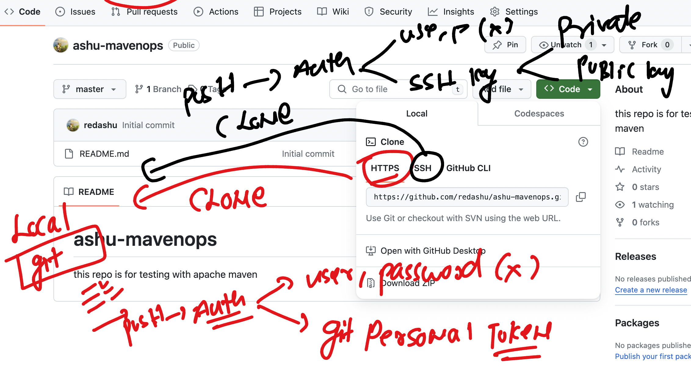

### Revision 


### Git hub repo clone and authentication understanding 




### https clone -- demo  and push 

```
 cd  /tmp 
➜  /tmp git clone https://github.com/redashu/ashu-mavenops.git
Cloning into 'ashu-mavenops'...
remote: Enumerating objects: 3, done.
remote: Counting objects: 100% (3/3), done.
remote: Compressing objects: 100% (2/2), done.
remote: Total 3 (delta 0), reused 0 (delta 0), pack-reused 0
Receiving objects: 100% (3/3), done.
➜  /tmp cd  ashu-mavenops


➜  ashu-mavenops git:(master) ls
README.md
➜  ashu-mavenops git:(master) echo hello >hello.java
➜  ashu-mavenops git:(master) ✗ ls
README.md  hello.java


➜  ashu-mavenops git:(master) ✗ git add .
➜  ashu-mavenops git:(master) ✗ git commit -m "hello java auth test"
[master 358a472] hello java auth test
 1 file changed, 1 insertion(+)
 create mode 100644 hello.java

====>> using username and password -- it will fail as per new github policy

➜  ashu-mavenops git:(master) git push 
Username for 'https://github.com': redashu
Password for 'https://redashu@github.com': 
remote: Support for password authentication was removed on August 13, 2021.
remote: Please see https://docs.github.com/en/get-started/getting-started-with-git/about-remote-repositories#cloning-with-https-urls for information on currently recommended modes of authentication.
fatal: Authentication failed for 'https://github.com/redashu/ashu-mavenops.git/'

====>> now using git personal access token 
➜  ashu-mavenops git:(master) git push 
Username for 'https://github.com': redashu
Password for 'https://redashu@github.com': 
Enumerating objects: 4, done.
Counting objects: 100% (4/4), done.
Delta compression using up to 8 threads
Compressing objects: 100% (2/2), done.
Writing objects: 100% (3/3), 286 bytes | 286.00 KiB/s, done.
Total 3 (delta 0), reused 0 (delta 0), pack-reused 0
To https://github.com/redashu/ashu-mavenops.git
   37b7613..358a472  master -> master

```

### lets test with ssh based clone 

```
[ashu@git-linux-server ashu-projects]$ ls
ashu-walmart-case1  java-app  python-sc  tasks  webapp

===>>>

[ashu@git-linux-server ashu-projects]$ git clone  git@github.com:redashu/ashu-mavenops.git
Cloning into 'ashu-mavenops'...
Warning: Permanently added the ECDSA host key for IP address '140.82.113.4' to the list of known hosts.
remote: Enumerating objects: 6, done.
remote: Counting objects: 100% (6/6), done.
remote: Compressing objects: 100% (4/4), done.
remote: Total 6 (delta 0), reused 3 (delta 0), pack-reused 0
Receiving objects: 100% (6/6), done.
[ashu@git-linux-server ashu-projects]$ ls
ashu-mavenops  ashu-walmart-case1  java-app  python-sc  tasks  webapp
[ashu@git-linux-server ashu-projects]$ 


```


### added some data 

```
[ashu@git-linux-server ashu-mavenops]$ ls
ashu.html  README.md
[ashu@git-linux-server ashu-mavenops]$ git add .
[ashu@git-linux-server ashu-mavenops]$ git commit  -m "web app change 1"
[master 5fcf6dd] web app change 1
 2 files changed, 12 insertions(+), 1 deletion(-)
 create mode 100644 ashu.html
 delete mode 100644 hello.java
```

### to push -- we are generating ssh-keypair 

```
[ashu@git-linux-server ashu-mavenops]$ ssh-keygen 
Generating public/private rsa key pair.
Enter file in which to save the key (/home/ashu/.ssh/id_rsa): 
/home/ashu/.ssh/id_rsa already exists.
Overwrite (y/n)? y
Enter passphrase (empty for no passphrase): 
Enter same passphrase again: 
Your identification has been saved in /home/ashu/.ssh/id_rsa.
Your public key has been saved in /home/ashu/.ssh/id_rsa.pub.
The key fingerprint is:
SHA256:oCClc64A4AmNT9NIOXaQYpIc/s/tToIg/QgMQyPRGYw ashu@git-linux-server
The key's randomart image is:
+---[RSA 2048]----+
|*&*O             |
|E=/ o            |
|XOo+  .          |
|+Bo. . .         |
|+oo..   S        |
|oo.o+ .          |
|. ...+ o         |
|      +          |
|      .o         |
+----[SHA256]-----+
```

### opening  sshkey public and copy to github account 

```
[ashu@git-linux-server ashu-mavenops]$ cat  /home/ashu/.ssh/id_rsa.pub
ssh-rsa AAAAB3NzaC1yc2EAAAADAQABAAABAQDS0oaPgjeLrzAToVMaR0wr8LxKKHgzn84qXa6O4hS9CLwvooSnuaXKpgLiHRov2BoyBWHsrAqSBQ0+XDulvWrcMHBELBYovlomdLksCVaADjhnqc72M6tVOm1MncgiyI4z9IqI18TxwXHMNbRGYvtzm2rasx/OO4m4e6tH9Iinv3WFHd1QLiiADlckCTHB+ccb7xoXrkEE8OD5UN+Jq2TIPA07v8VgnHpfmvIUUcv3sOP3krsCij87F9wO5xK2jGFiFbiB+LbwjODmAb4UsUhZ1kDeWMD8Ff5SrLaVUXey+QcbjZsO/6RQO48QYaI1ZQCQkoEBpKpXbA/17OR2JDRL ashu@git-linux-server
[ashu@git-linux-server ashu-mavenops]$ 
[ashu@git-linux-server ashu-mavenops]$ 
[ashu@git-linux-server ashu-mavenops]$ ls   /home/ashu/.ssh/
id_rsa  id_rsa.pub  known_hosts
```

### after adding key 

```
[ashu@git-linux-server ashu-mavenops]$ git push
Enumerating objects: 4, done.
Counting objects: 100% (4/4), done.
Delta compression using up to 4 threads
Compressing objects: 100% (3/3), done.
Writing objects: 100% (3/3), 445 bytes | 445.00 KiB/s, done.
Total 3 (delta 0), reused 0 (delta 0), pack-reused 0
To github.com:redashu/ashu-mavenops.git
   358a472..5fcf6dd  master -> master
```

### java based build automation tool intro


### Installing maven in rhel / amazon linux machine 

```
 yum install  java-11*
Failed to set locale, defaulting to C
Loaded plugins: extras_suggestions, langpacks, priorities, update-motd
amzn2-core                                                                                                                            | 3.6 kB  00:00:00     
Resolving Dependencies
--> Running transaction check
---> Package java-11-amazon-corretto.x86_64 1:11.0.21+9-1.amzn2 will be installed
--> Processing Dependency: libX11 for package: 1:java-11-amazon-corretto-11.0.21+9-1.amzn2.x86_64
--> Processing Dependency: libXi for package: 1:java-11-amaz
```

### Verify jdk 11

```
[ashu@git-linux-server ashu-mavenops]$ java --version 
openjdk 11.0.21 2023-10-17 LTS
OpenJDK Runtime Environment Corretto-11.0.21.9.1 (build 11.0.21+9-LTS)
OpenJDK 64-Bit Server VM Corretto-11.0.21.9.1 (build 11.0.21+9-LTS, mixed mode)
[ashu@git-linux-server ashu-mavenops]$ 


```

### Installing maven on the same server under each user 

```
[ashu@git-linux-server ashu-mavenops]$ cd  ~
[ashu@git-linux-server ~]$ ls
ashu-projects
[ashu@git-linux-server ~]$ wget https://dlcdn.apache.org/maven/maven-3/3.9.6/binaries/apache-maven-3.9.6-bin.tar.gz
--2024-01-16 10:14:02--  https://dlcdn.apache.org/maven/maven-3/3.9.6/binaries/apache-maven-3.9.6-bin.tar.gz
Resolving dlcdn.apache.org (dlcdn.apache.org)... 151.101.2.132, 2a04:4e42::644
Connecting to dlcdn.apache.org (dlcdn.apache.org)|151.101.2.132|:443... connected.
HTTP request sent, awaiting response... 200 OK
Length: 9410508 (9.0M) [application/x-gzip]
Saving to: ‘apache-maven-3.9.6-bin.tar.gz’

100%[=======================================================================================>] 9,410,508   --.-K/s   in 0.06s   

2024-01-16 10:14:02 (148 MB/s) - ‘apache-maven-3.9.6-bin.tar.gz’ saved [9410508/9410508]

[ashu@git-linux-server ~]$ ls
apache-maven-3.9.6-bin.tar.gz  ashu-projects
[ashu@git-linux-server ~]$ 

```

### decompress maven 

```
[ashu@git-linux-server ~]$ ls
apache-maven-3.9.6-bin.tar.gz  ashu-projects
[ashu@git-linux-server ~]$ 
[ashu@git-linux-server ~]$ 
[ashu@git-linux-server ~]$ tar xvzf  apache-maven-3.9.6-bin.tar.gz 
apache-maven-3.9.6/README.txt
apache-maven-3.9.6/LICENSE
apache-maven-3.9.6/NOTICE
```

### checking directory 

```
[ashu@git-linux-server ~]$ ls
apache-maven-3.9.6  apache-maven-3.9.6-bin.tar.gz  ashu-projects
[ashu@git-linux-server ~]$ 
[ashu@git-linux-server ~]$ ls apache-maven-3.9.6/
bin  boot  conf  lib  LICENSE  NOTICE  README.txt
[ashu@git-linux-server ~]$ 
[ashu@git-linux-server ~]$ ls apache-maven-3.9.6/bin
m2.conf  mvn  mvn.cmd  mvnDebug  mvnDebug.cmd  mvnyjp
[ashu@git-linux-server ~]$ ls apache-maven-3.9.6/conf
logging  settings.xml  toolchains.xml
[ashu@git-linux-server ~]$ ls apache-maven-3.9.6/boot/
plexus-classworlds-2.7.0.jar  plexus-classworlds.license
[ashu@git-linux-server ~]$ 

```

### Explore installation as ENV variable 

```
[ashu@git-linux-server ~]$ export  MAVEN_CONFIG=/home/ashu/apache-maven-3.9.6
[ashu@git-linux-server ~]$ 
[ashu@git-linux-server ~]$ export PATH=$PATH:$MAVEN_CONFIG/bin
[ashu@git-linux-server ~]$ 
[ashu@git-linux-server ~]$ export PATH
[ashu@git-linux-server ~]$


[ashu@git-linux-server ~]$ mvn --version 
Apache Maven 3.9.6 (bc0240f3c744dd6b6ec2920b3cd08dcc295161ae)
Maven home: /home/ashu/apache-maven-3.9.6
Java version: 11.0.21, vendor: Amazon.com Inc., runtime: /usr/lib/jvm/java-11-amazon-corretto.x86_64
Default locale: en_US, platform encoding: UTF-8
OS name: "linux", version: "5.10.205-195.804.amzn2.x86_64", arch: "amd64", family: "unix"
[ashu@git-linux-server ~]$ 


```

### setting env variable parmanently

```
=====>> opening file

 nano  /home/ashu/.bashrc

# User specific aliases and functions
MAVEN_CONFIG=/home/ashu/apache-maven-3.9.6
PATH=$PATH:$MAVEN_CONFIG/bin
export PATH
```

