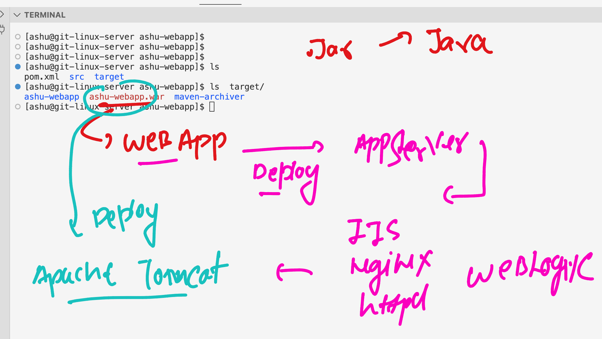
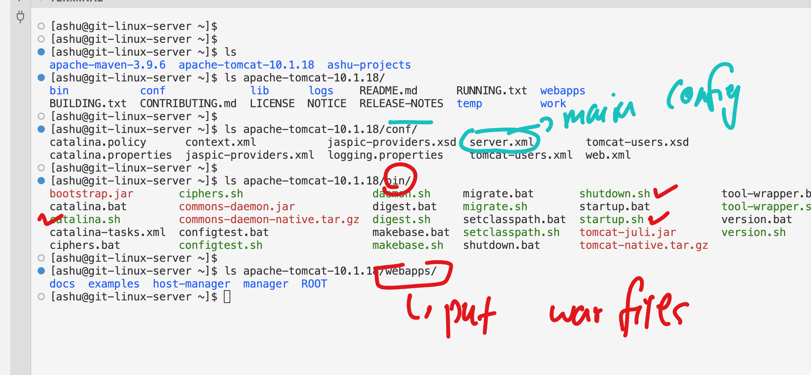
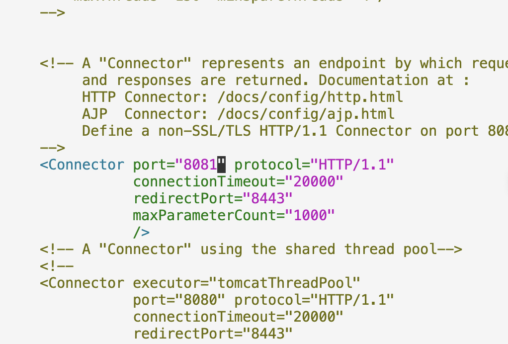
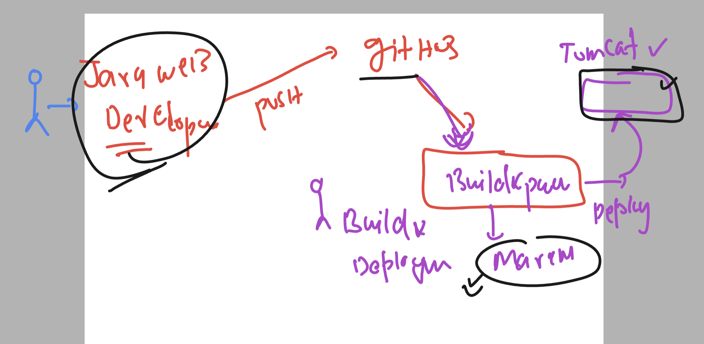
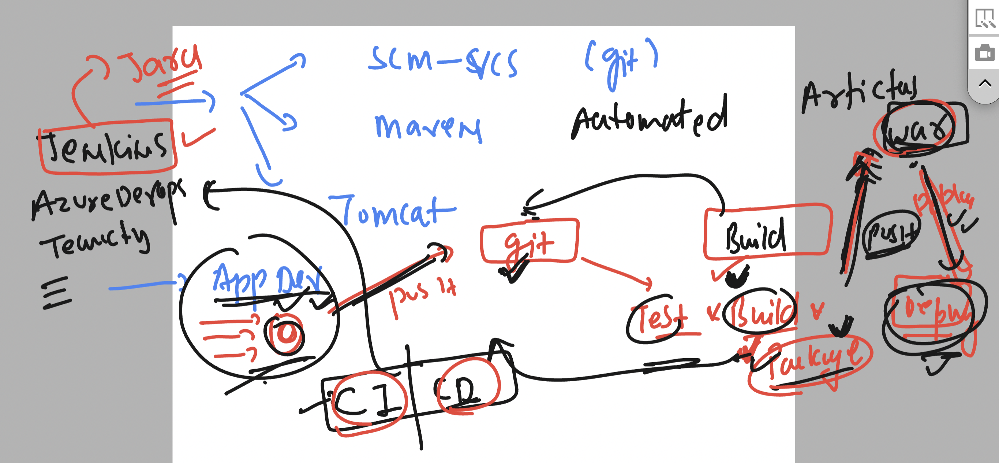
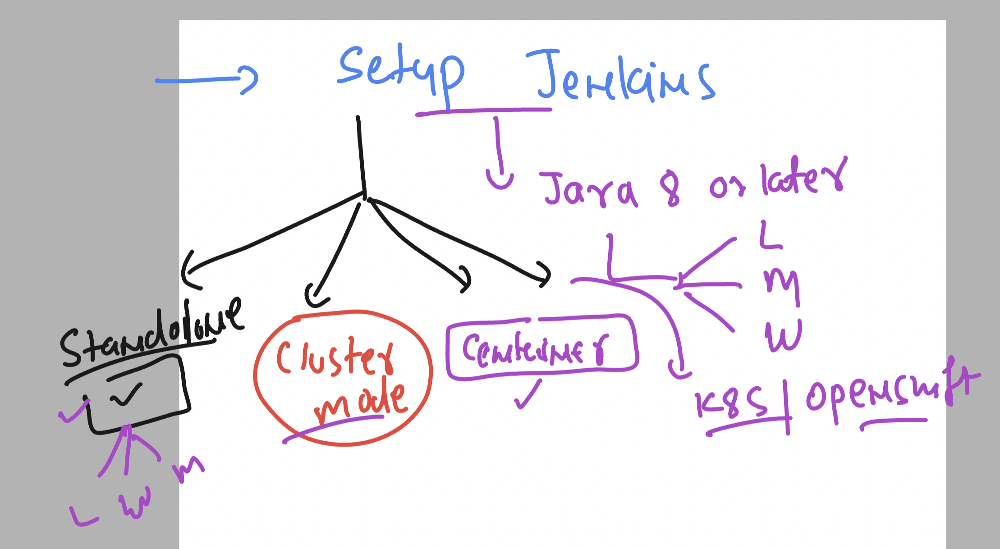

# walmart-cicd-15thjan-2024

### Creating webapp using maven from vscode 

```
ashu@git-linux-server java-app]$ ls
ashu2-demo  ashudemo  ashu-webapp
[ashu@git-linux-server java-app]$ tree  ashu-webapp/
ashu-webapp/
├── pom.xml
└── src
    └── main
        └── webapp
            ├── index.jsp
            └── WEB-INF
                └── web.xml

4 directories, 3 files
```

### doing mvn install 

```
[ashu@git-linux-server ashu-webapp]$ mvn install 
[INFO] Scanning for projects...
[INFO] 
[INFO] ---------------------< com.ashutoshh:ashu-webapp >----------------------
[INFO] Building ashu-webapp Maven Webapp 1.0-SNAPSHOT
[INFO]   from pom.xml
[INFO] --------------------------------[ war ]---------------------------------
[INFO] 
[INFO] --- resources:3.0.2:resources (default-resources) @ ashu-webapp ---
[INFO] Using 'UTF-8' encoding to copy filtered resources.
[INFO] skip non existing resourceDirectory /home/ashu/ashu-projects/java-app/ashu-webapp/src/main/resources
[INFO] 
[INFO] --- compiler:3.8.0:compile (default-compile) @ ashu-webapp ---
[INFO] No sources to compile
[INFO] 
[INFO] --- resources:3.0.2:testResources (default-testResources) @ ashu-webapp ---
[INFO] Using 'UTF-8' encoding to copy filtered resources.
[INFO] skip non existing resourceDirectory /home/ashu/ashu-projects/java-app/ashu-webapp/src/test/resources
[INFO] 
[INFO] --- compiler:3.8.0:testCompile (default-testCompile) @ ashu-webapp ---
[INFO] No sources to compile
[INFO] 
[INFO] --- surefire:2.22.1:test (default-test) @ ashu-webapp ---
[INFO] No tests to run.
[INFO] 
[INFO] --- war:3.2.2:war (default-war) @ ashu-webapp ---
[INFO] Packaging webapp
[INFO] Assembling webapp [ashu-webapp] in [/home/ashu/ashu-projects/java-app/ashu-webapp/target/ashu-webapp]
[INFO] Processing war project
[INFO] Copying webapp resources [/home/ashu/ashu-projects/java-app/ashu-webapp/src/main/webapp]
[INFO] Webapp assembled in [18 msecs]
[INFO] Building war: /home/ashu/ashu-projects/java-app/ashu-webapp/target/ashu-webapp.war
[INFO] 
[INFO] --- install:2.5.2:install (default-install) @ ashu-webapp ---
[INFO] Installing /home/ashu/ashu-projects/java-app/ashu-webapp/target/ashu-webapp.war to /home/ashu/.m2/repository/com/ashutoshh/ashu-webapp/1.0-SNAPSHOT/ashu-webapp-1.0-SNAPSHOT.war
[INFO] Installing /home/ashu/ashu-projects/java-app/ashu-webapp/pom.xml to /home/ashu/.m2/repository/com/ashutoshh/ashu-webapp/1.0-SNAPSHOT/ashu-webapp-1.0-SNAPSHOT.pom
[INFO] ------------------------------------------------------------------------
[INFO] BUILD SUCCESS
[INFO] ------------------------------------------------------------------------
[INFO] Total time:  1.414 s
[INFO] Finished at: 2024-01-17T08:53:12Z
[INFO] ------------------------------------------------------------------------


[ashu@git-linux-server ashu-webapp]$ ls
pom.xml  src  target
[ashu@git-linux-server ashu-webapp]$ ls target/
ashu-webapp  ashu-webapp.war  maven-archiver
```

### incase you are only testing install then want to remove -- target outcome 

```
 mvn clean 
[INFO] Scanning for projects...
[INFO] 
[INFO] ---------------------< com.ashutoshh:ashu-webapp >----------------------
[INFO] Building ashu-webapp Maven Webapp 1.0-SNAPSHOT
[INFO]   from pom.xml
[INFO] --------------------------------[ war ]---------------------------------
Downloading from central: https://repo.maven.apache.org/maven2/org/apache/maven/plugins/maven-clean-plugin/3.1.0/maven-clean-plugin-3.1.0.pom
Downloaded from central: https://repo.maven.apache.org/maven2/org/apache/maven/plugins/maven-clean-plugin/3.1.0/maven-clean-plugin-3.1.0.pom (5.2 kB at 25 kB/s)
Downloading from central: https://repo.maven.apache.org/maven2/org/apache/maven/plugins/maven-clean-plugin/3.1.0/maven-clean-plugin-3.1.0.jar
Downloaded from central: https://repo.maven.apache.org/maven2/org/apache/maven/plugins/maven-clean-plugin/3.1.0/maven-clean-plugin-3.1.0.jar (30 kB at 1.6 MB/s)
[INFO] 
[INFO] --- clean:3.1.0:clean (default-clean) @ ashu-webapp ---
[INFO] Deleting /home/ashu/ashu-projects/java-app/ashu-webapp/target
[INFO] ------------------------------------------------------------------------
[INFO] BUILD SUCCESS
[INFO] ------------------------------------------------------------------------
[INFO] Total time:  0.839 s
[INFO] Finished at: 2024-01-17T08:54:19Z
```

### additional commands

```
 mvn clean 
  235  ls
  236  mvn install
  237  ls
  238  mvn package
  239  ls
  240  history 
  241  mvn compile
  242  mvn test
```

### Testing war file on apache tomcat



### Installing tomcat 

### Download 

```
 wget https://dlcdn.apache.org/tomcat/tomcat-10/v10.1.18/bin/apache-tomcat-10.1.18.tar.gz
```

### extract 

```
tar xvzf apache-tomcat-10.1.18.tar.gz 
```

### Understanding tomcat directory structure 



### setting ENV 

```
[ashu@git-linux-server apache-tomcat-10.1.18]$ export TOMCAT_HOME=/home/ashu/apache-tomcat-10.1.18
[ashu@git-linux-server apache-tomcat-10.1.18]$ export PATH=$PATH:$TOMCAT_HOME/bin
[ashu@git-linux-server apache-tomcat-10.1.18]$ export PATH
[ashu@git-linux-server apache-tomcat-10.1.18]$ c
bash: c: command not found
[ashu@git-linux-server apache-tomcat-10.1.18]$ cd
[ashu@git-linux-server ~]$ 
[ashu@git-linux-server ~]$

====>> Starting 
[ashu@git-linux-server ~]$ startup.sh 
Using CATALINA_BASE:   /home/ashu/apache-tomcat-10.1.18
Using CATALINA_HOME:   /home/ashu/apache-tomcat-10.1.18
Using CATALINA_TMPDIR: /home/ashu/apache-tomcat-10.1.18/temp
Using JRE_HOME:        /usr
Using CLASSPATH:       /home/ashu/apache-tomcat-10.1.18/bin/bootstrap.jar:/home/ashu/apache-tomcat-10.1.18/bin/tomcat-juli.jar
Using CATALINA_OPTS:   
Tomcat started.

====>> stop

[ashu@git-linux-server ~]$ shutdown.sh 
Using CATALINA_BASE:   /home/ashu/apache-tomcat-10.1.18
Using CATALINA_HOME:   /home/ashu/apache-tomcat-10.1.18
Using CATALINA_TMPDIR: /home/ashu/apache-tomcat-10.1.18/temp
Using JRE_HOME:        /usr
Using CLASSPATH:       /home/ashu/apache-tomcat-10.1.18/bin/bootstrap.jar:/home/ashu/apache-tomcat-10.1.18/bin/tomcat-juli.jar
Using CATALINA_OPTS:   
```


### making env persistent

```
[ashu@git-linux-server ~]$ cat  /home/ashu/.bashrc 
# .bashrc

# Source global definitions
if [ -f /etc/bashrc ]; then
        . /etc/bashrc
fi

# Uncomment the following line if you don't like systemctl's auto-paging feature:
# export SYSTEMD_PAGER=

# User specific aliases and functions
TOMCAT_HOME=/home/ashu/apache-tomcat-10.1.18
MAVEN_CONFIG=/home/ashu/apache-maven-3.9.6
PATH=$PATH:$MAVEN_CONFIG/bin:$TOMCAT_HOME/bin
export PATH
```
### changing tomcat port to 8081 



### below  is the path for server.xml 

```
[ashu@git-linux-server ~]$ ls
apache-maven-3.9.6  apache-tomcat-10.1.18  ashu-projects
[ashu@git-linux-server ~]$ 
[ashu@git-linux-server ~]$ cd apache-tomcat-10.1.18/
[ashu@git-linux-server apache-tomcat-10.1.18]$ ls
bin           conf             lib      logs    README.md      RUNNING.txt  webapps
BUILDING.txt  CONTRIBUTING.md  LICENSE  NOTICE  RELEASE-NOTES  temp         work
[ashu@git-linux-server apache-tomcat-10.1.18]$ cd conf/
[ashu@git-linux-server conf]$ ls
Catalina         catalina.properties  jaspic-providers.xml  logging.properties  tomcat-users.xml  web.xml
catalina.policy  context.xml          jaspic-providers.xsd  server.xml          tomcat-users.xsd
[ashu@git-linux-server conf]$ nano  server.xml 
[ashu@git-linux-server conf]$ 
[ashu@git-linux-server conf]$ 

```

### java webapp to tomcat journey 




### deploy war to tomcat 

```
ashu@git-linux-server java-app]$ cd ashu-webapp/
[ashu@git-linux-server ashu-webapp]$ ls
pom.xml  src  target
[ashu@git-linux-server ashu-webapp]$ ls target/
ashu-webapp  ashu-webapp.war  maven-archiver
[ashu@git-linux-server ashu-webapp]$ cp -v target/ashu-webapp.war   /home/ashu/apache-tomcat-10.1.18/webapps/
‘target/ashu-webapp.war’ -> ‘/home/ashu/apache-tomcat-10.1.18/webapps/ashu-webapp.war’
```

### to access 

```
http://34.202.73.46:8081/ashu-webapp/
```

### Introduction to cicd process in brief 



### Installation of jenkins as options 



## Installing on RHEL 

### Installing java 11

```
yum install java-11* 
```

### create repo 

```
sudo wget -O /etc/yum.repos.d/jenkins.repo     https://pkg.jenkins.io/redhat-stable/jenkins.repo
```

### installing gpgkey 

```
sudo rpm --import https://pkg.jenkins.io/redhat-stable/jenkins.io-2023.key
```

### Installing jenkins 

```
yum install jenkins 
```

### starting jenkins 

```
systemctl start jenkins
[root@ip-172-31-32-154 ~]# systemctl enable jenkins
Created symlink from /etc/systemd/system/multi-user.target.wants/jenkins.service to /usr/lib/systemd/system/jenkins.service.
[root@ip-172-31-32-154 ~]# systemctl status jenkins
● jenkins.service - Jenkins Continuous Integration Server
   Loaded: loaded (/usr/lib/systemd/system/jenkins.service; enabled; vendor preset: disabled)
   Active: active (running) since Wed 2024-01-17 10:24:50 UTC; 11s ago
 Main PID: 3985 (java)
   CGroup: /system.slice/jenkins.service

```

### you can use below link for installation 

[click_here](https://www.jenkins.io/doc/book/installing/)

